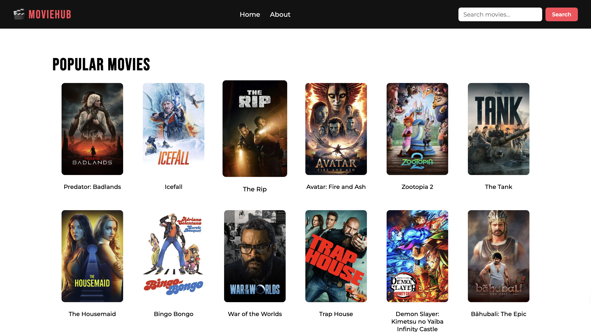
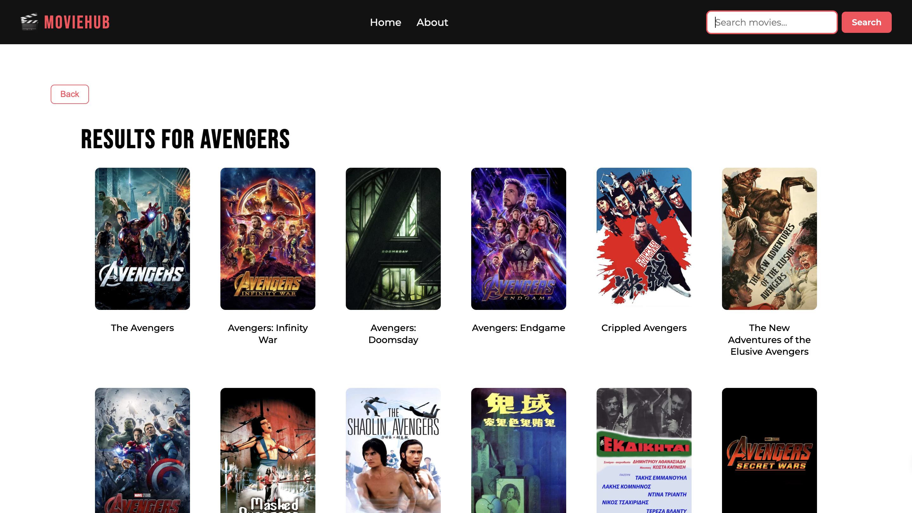
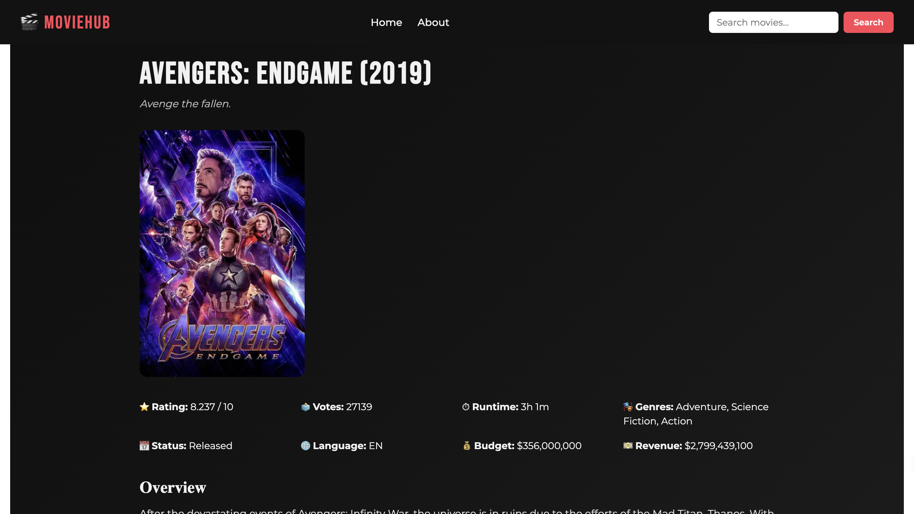
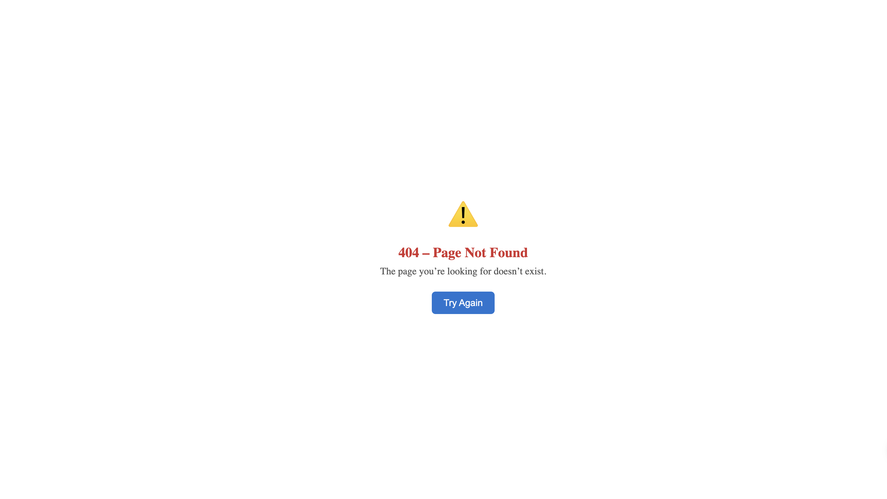

# 🎬 Movie Explorer App

Movie Explorer is a React-based web application that allows users to discover popular movies, search for films, and view detailed information about individual movies using real-time data from the TMDb API.

This project focuses on building a scalable, maintainable frontend application using modern React patterns and best practices.

---

## 🛠️ Tech Stack

- **React** – UI development using functional components and hooks  
- **React Router** – Client-side routing and navigation  
- **React Query** – Server-state management, caching, and async handling  
- **TMDb API** – Movie data source  
- **Styled Components** – Component-level styling  

---

## ✨ Features

### Core Features
- Browse popular movies
- Search movies by name
- View detailed information for individual movies

### Technical Features
- Client-side routing with dynamic routes
- Server-state management using React Query
- Centralized API service layer for data fetching
- Environment variable–based API key handling
- Efficient caching and controlled refetching

### UX & Reliability
- Reusable loading indicators
- Graceful error fallback UI with retry options
- Missing poster image handling
- Custom 404 (Not Found) page

---

## 🏗️ Application Architecture

The application follows a clean separation of concerns to ensure scalability and maintainability.

### 1. Routing
- Client-side routing implemented using React Router
- Layout pattern with shared Navbar and Footer
- Dynamic routes for movie details pages

### 2. Data Fetching
- React Query is used for server-state management
- Page-level queries to keep data ownership localized
- A centralized service layer abstracts all API communication

### 3. State Management
- React Query manages all asynchronous and server state
- Local component state is used only for UI-specific concerns

### 4. Loading & Error Handling
- Reusable loading and error components
- Friendly error messages and recovery actions
- Edge cases such as invalid movie IDs are handled gracefully

---

## 📸 Screenshots

### Home Page – Popular Movies


### Search Results


### Movie Details Page


### Error / Fallback UI


---

## 🚀 Getting Started

1. Clone the repository  
2. Install dependencies  

   ```bash
   npm install
3. Create a .env file and add your TMDb API key

    ```bash
    VITE_TMDB_API_KEY=your_api_key_here

4. Run the application
    ```bash
       npm run dev
